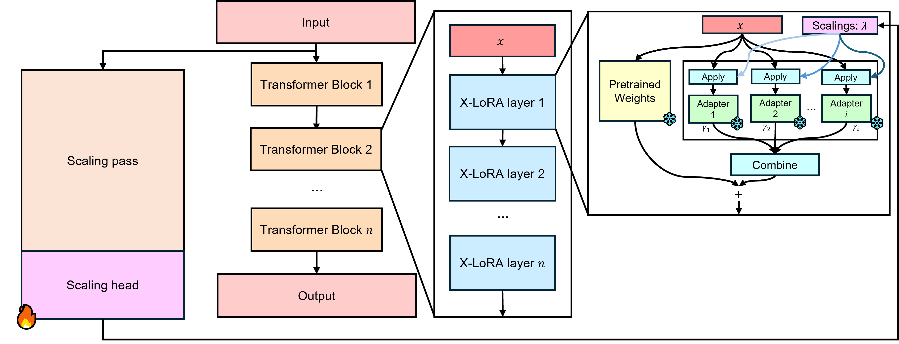

# X-LoRA
Mixture of LoRA Experts: Leverage the power of fine-tuned LoRA experts by employing a mixture of experts, or MoE technique.

X-LoRA works by learning scaling values for LoRA adapters. These learned scalings values are used to
gate the LoRA experts in a dense fashion. Additionally, all LoRA adapters and the base model are frozen, allowing efficient fine tuning due to a low parameter count.

X-LoRA is easily applied to any HuggingFace Transformers model. Please see our weights, [here](https://huggingface.co/lamm-mit/x-lora) and our [paper](https://arxiv.org/abs/2402.07148).

### Token-by-token scalings


## Advantages and features
- Effective: Dense gating of experts allows effective mixing
- Efficient fine-tuning: low trainable parameter count
- Hierarchical encapsulated strategy: Re-use existing trained models or model section and re-use them to address complex tasks that cut across experts, following a bio-inspired strategy 
- Easy-to-use API: `add_xlora_to_model`, broad compatibility 
- Dynamically mix LoRA adapters: Deep layer-wise combinations of adapters.

### Architecture
<p align="center">
    
</p>

See the [examples](examples) folder for some examples of how to get started with X-LoRA.

## Efficient Inference Support
[Mistral.rs](https://github.com/EricLBuehler/mistral.rs) is an inference framework which supports X-LoRA! To use it, follow the installation instructions and run the following command to start up an X-LoRA inference platform.

`./mistralrs-server --port 1234 x-lora-mistral -o ordering.json`

Base and X-LoRA Huggingface model IDs may be specified through command line switches to use your own models. Please see the Github page for further details.

## Installation
Pending a pip release, run the following command to install X-LoRA.

`pip install git+https://github.com/EricLBuehler/xlora.git`

## Examples
Excerpt from [this](./examples/simple.ipynb) example.

- [Converting a model](README.md#converting-a-model)
- [Loading a trained X-LoRA model from scratch](README.md#loading-a-trained-x-lora-model-from-scratch)
- [Loading a trained X-LoRA model with a convenience function](README.md#loading-a-trained-x-lora-model-with-a-convenience-function)
- [Scalings logging](README.md#scalings-logging)
- [Trainable parameters](README.md#trainable-parameters)
- [Setting trainability of adapters dynamically](README.md#setting-trainability-of-adapters-dynamically)
- [Setting and resetting the scaling pass value](README.md#setting-and-resetting-the-scaling-pass-value)
- [Setting and getting the global LoRA weight](README.md#setting-and-getting-the-global-lora-weight)
- [Setting and getting the top-k lora value](README.md#setting-and-getting-the-top-k-lora-value)

### Converting a model
```python
import torch
import xlora
from transformers import AutoConfig, AutoModelForCausalLM # type: ignore

model = AutoModelForCausalLM.from_pretrained(
    "mistralai/Mistral-7B-Instruct-v0.1",
    trust_remote_code=True,
    use_flash_attention_2=False,
    device_map="cuda:0",
    torch_dtype=torch.bfloat16,
)

config = AutoConfig.from_pretrained(
    "mistralai/Mistral-7B-Instruct-v0.1",
    trust_remote_code=True,
    use_flash_attention_2=False,
    device_map="auto",
)

### Convert the model to X-LoRA
model_created = xlora.add_xlora_to_model(
    model=model,
    xlora_config=xlora.xLoRAConfig(
        config.hidden_size,
        base_model_id="mistralai/Mistral-7B-Instruct-v0.1",
        xlora_depth=8,
        device=torch.device("cuda"),
        adapters={
            "adapter_1": "./path/to/the/checkpoint/",
            "adapter_2": "./path/to/the/checkpoint/",
            "adapter_n": "./path/to/the/checkpoint/",
        },
    ),
    verbose=True,
)
```
### Loading a trained X-LoRA model from scratch
```python
import torch
import xlora
from transformers import AutoConfig, AutoModelForCausalLM # type: ignore

model = AutoModelForCausalLM.from_pretrained(
    "mistralai/Mistral-7B-Instruct-v0.1",
    trust_remote_code=True,
    use_flash_attention_2=False,
    device_map="cuda:0",
    torch_dtype=torch.bfloat16,
)

config = AutoConfig.from_pretrained(
    "mistralai/Mistral-7B-Instruct-v0.1",
    trust_remote_code=True,
    use_flash_attention_2=False,
    device_map="auto",
)

model_created = xlora.from_pretrained(
    "./path/to/saved/model",
    model,
    "cuda",
)
```

### Loading a trained X-LoRA model with a convenience function
```python
import torch
from xlora.xlora_utils import load_model  # type: ignore

XLoRA_model_name = "myuser/repo"

model_loaded, tokenizer = load_model(
    model_name=XLoRA_model_name,
    device="cuda:0",
    dtype=torch.bfloat16,
    adapters={
        "adapter_1": "./path/to/the/checkpoint/",
        "adapter_2": "./path/to/the/checkpoint/",
        "adapter_n": "./path/to/the/checkpoint/",
    },
)
```

### Scalings logging
```python
# Enable scalings logging and begin a log
model_created.enable_scalings_logging()

# Run forward passes to accumulate a log

# Write the log to a file, or multiple.
model_created.flush_log_scalings("./path/to/output/file")

# Get a shallow copy of the scalings
log_copy = model_created.get_scalings_log()

# Disable scalings logging
model_created.disable_scalings_logging()

# Clear the scalings log
model_created.clear_scalings_log()

# Get the latest scalings prediction
scalings_pred = model_created.get_latest_scalings()

# Load the scalings log from a file, or multiple automatically.
loaded_log = xlora.xlora_utils.load_scalings_log("./path/to/output/file", verbose=True)
```

### Trainable parameters
```python
model: xLoRAModel = ... # Load the model

num_trainable, num_all_params = model.get_nb_trainable_parameters()

model.print_trainable_parameters()
```

### Setting trainability of adapters dynamically
```python
model: xLoRAModel = ... # Load the model

# Use trainable adapters: mark all adapters as trainable
model.set_use_trainable_adapters(True)

# Get the current status of the trainable adapters, in this case returning True
model.get_use_trainable_adapters()
```

### Setting and resetting the scaling pass value
```python
model: xLoRAModel = ... # Load the model

# Set the scaling pass value to 0, meaning that no adapters will contribute to the scaling pass output
model.set_scaling_pass_value(0)

# Allow the model to use the default scaling pass value
model.set_scaling_pass_value(None)
```

### Setting and getting the global LoRA weight
```python
model: xLoRAModel = ... # Load the model

# Multiply the output of each LoRA adapter by 2, additionally to the scalings.
model.set_global_scaling_weight(2)

# Returns 2
res = model.get_global_scaling_weight()
```

### Setting and getting the top-k lora value
```python
# Use the top 2 lora experts
model_created.set_topk_lora(2)

# Returns 2
res = model_created.get_topk_lora()
```

## API
The X-LoRA API is composed of 3 parts: the "Global API", the "Model API" and the "Utility API". Generally the global API is used to create X-LoRA models and the model API is used to interface with the models while the Utility API provides useful utility functions.

- [Global API](README.md#global-api): `xlora.*`
  - `xlora.add_xlora_to_model`
  - `xlora.from_pretrained`
- [Utility API](README.md#utility-api): `xlora.xlora_utils.*`
  - `xlora.xlora_utils.load_scalings_log`
  - `xlora.xlora_utils.load_model`
- [Model API](README.md#model-api): `xLoraModel.*`
  - [Scalings](README.md#scalings)
    - `xLoraModel.disable_scalings_logging`
    - `xLoraModel.enable_scalings_logging`
    - `xLoraModel.flush_log_scalings`
    - `xLoraModel.get_scalings_log`
    - `xLoraModel.set_scaling_pass_value`
    - `xLoraModel.get_latest_scalings`
    - `xLoraModel.set_global_lora_weight`
    - `xLoraModel.get_global_lora_weight`
  - [Trainable parameters](README.md#trainable-parameters-1)
    - `xLoraModel.get_nb_trainable_parameters`
    - `xLoraModel.print_trainable_parameters`
  - [Trainable adapters](README.md#setting-the-trainable-adapters)
    - `xLoraModel.set_use_trainable_adapters`
    - `xLoraModel.get_use_trainable_adapters`

### X-LoRA Config
The X-LoRA Config saves the full configuration of an X-LoRA model.
```python
Args:
    hidden_size (`int`):
        Hidden size of the base model.
    device (`torch.device`):
        Device for the X-LoRA classifier.
    enable_softmax (`bool`, *optional*, defaults to `True`):
        Enable softmax application for the X-LoRA classifier.
    enable_softmax_topk (`bool`, *optional*, defaults to `False`):
        Enable softmax application for the top-k LoRA adapters. Mutually exclusive to `enable_softmax` and must only be set if `top_k_lora` is.
    softmax_temperature (`float`, *optional*, defaults to 1.0):
        Softmax temperature, lower yields sharper predictions
    layerwise_scalings (`bool`, *optional*, defaults to `False`):
        Generate scalings for each layer.
    top_k_lora (`int`, *optional*, defaults to None):
        Sparsely select the top_k LoRA experts instead of the default dense method.
    xlora_depth (`int`, *optional*, defaults to 1):
        Depth of the X-LoRA classifier.
    xlora_size (`int`, *optional*, defaults to 2048):
        Hidden size of the X-LoRA classifier, irrelevant if `xlora_depth=1`.
    enable_relu_and_dropout (`bool`, *optional*, defaults to `False`):
        Enable ReLU activation and Dropout application of the X-LoRA classifier.
    use_bias (`bool`, *optional*, defaults to `True`):
        Enable bias in X-LoRA classifier.
    xlora_dropout_p (`float`, *optional*, defaults to 0.2):
        Dropout probability of the X-LoRA classifier, irrelevant if `xlora_depth=1` or `enable_relu_and_dropout=True`.
    stop_token_id (`int`, *optional*):
        The id of the stop token for the input. If this is None, the sequence length is calculated using the attention mask.
    use_trainable_adapters (`bool`, *optional*, defaults to False):
        Make the adapters trainable.
    scaling_pass_value (`float`, *optional*, defaults to 0):
        Scaling pass value.
    global_scaling_weight (`float`, *optional*, defaults to 1):
        Weight to multiply output of each LoRA adapter by.
```

### Global API
- `xlora.add_xlora_to_model(model: PreTrainedModel, xlora_config: xLoRAConfig, adapters: Dict[str, str], verbose: bool) -> xLoraModel`
  - Convert a model to an xLoraModel, instantiating the classifier and adapters.
- `xlora.from_pretrained(load_directory: str, model: PreTrainedModel, adapters: adapters: Optional[Dict[str, str]] = None, verbose: bool, device: str, from_safetensors: bool = True, hf_hub_subdir: Optional[str] = None) -> xLoraModel`
  - Load the X-LoRA classifier and potentially adapters. This should be called after an X-LoRA classifier has been trained.

### Utility API
- `xlora.xlora_utils.load_scalings_log(path: str, verbose: bool = False) -> List[torch.Tensor]`
  - Load the scalings log, with awareness to the two types.
- `xlora.xlora_utils.load_model(model_name: str, device: str, dtype: torch.dtype, adapters: Dict[str, str], use_flash_attention_2: bool = False, load_xlora: bool = True, verbose: bool = False, hf_hub_subdir: Optional[str] = None) -> Tuple[Union[AutoModelForCausalLM, xLoRAModel], Union[PreTrainedTokenizer, PreTrainedTokenizerFast]`
  - Convenience function to load a model with the specified adapters like the X-LoRA config, converting it to X-LoRA if specified.

### Model API
#### Scalings
- `xLoraModel.disable_scalings_logging()`
  - Disable scalings logging, without clearing the log.
- `xLoraModel.clear_scalings_log()`
  - Clear the scalings log.
- `xLoraModel.enable_scalings_logging()`
  - Enable scalings logging. Each time a forward pass occurs, the predicted scalings will be logged.
- `xLoraModel.flush_log_scalings(path: str)`
  - Write the scalings log (a tensor of shape (num_logged, batch_size, seq_len, n_layers, n_classes)) to the specified path.
    If the tensor cannot be constructed, multiple files are written containing tensors of shape
    (num_logged, batch_size, seq_len, n_layers, n_classes) such that each file contains one sequence length. Additionally a JSON
    file is outputted containing the mapping from each sequence log file to the index of the contained tensor so that one may reconstruct
    the log order.
    The file specified should not contain an extension.
- `xLoraModel.get_scalings_log(self) -> List[Tensor]`
  - Returns a shallow (only copying the list itself not the tensors) copy of the list containing the scalings log. Editing the list does not change the underlying log.
    The tensors are of shape (batch_size, seq_len, n_layers, n_classes). The seq_len dim may vary with input dimension.
- `xLoraModel.set_scaling_pass_value(self, value: Union[Number, None])`
  - Manually set the scalings to a specific value during the scaling pass, forever. Call this function with None to enable the default scalings. This is reflected in the config.
- `xLoraModel.get_latest_scalings(self) -> Optional[Tensor]`
  - Returns the latest scalings prediction, or None if no scalings have been predicted. The tensor is of shape (batch_size, seq_len, n_layers, n_classes).
- `xLoraModel.set_global_scaling_weight(self, weight: float)`
  - Set the global LoRA weight, a scalar to multiply the output of each LoRA adapter by. This is by default 1. This is reflected in the config.
- `xLoraModel.get_global_scaling_weight(self) -> float`
  - Get the global LoRA weight.
#### Trainable parameters
- `xLoraModel.get_nb_trainable_parameters() -> Tuple[int, int]`
  - Return a tuple `(num_trainable, num_all_params)`
- `xLoraModel.print_trainable_parameters()`
  - Print the trainable and non-trainable parameters for the given model, including with the X-LoRA components.
#### Setting the trainable adapters
- `xLoraModel.set_use_trainable_adapters(use_trainable_adapters: bool)`
  - Set the trainability of the adapters. This is reflected in the config.
- `xLoraModel.get_use_trainable_adapters(self) -> bool`
  - Get the trainable or not trainable state of the adapters.
#### Top-k
- `xLoraModel.set_topk_lora(self, value: Optional[int])`
  - Sparsely select the specified top_k LoRA experts instead of the default dense method. Set to None to use dense. This is reflected in the config.
- `xLoraModel.get_topk_lora(self) -> Optional[int]`
  - Get the current top_k LoRA experts value.

## Original paper and citation

Cite this work as:
```bibtex
@article{Buehler_XLoRA_2024,
    title   = {X-LoRA: Mixture of Low-Rank Adapter Experts, a Flexible Framework for Large Language Models with Applications in Protein Mechanics and Design},
    author  = {E.L. Buehler, M.J. Buehler},
    journal = {},
    year    = {2024},
    volume  = {},
    pages   = {},
    url     = {https://arxiv.org/abs/2402.07148}
}
```

## Contributing
Please run `make style` before submitting a PR.
