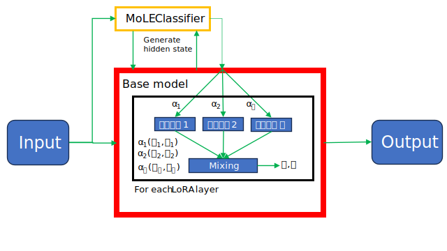

# MoLE
Mixture of LoRA Experts: leverage the power of fine-tuned LoRA experts by employing a mixture of experts, or MoE technique.

MoLE works by learning the alpha scaling values for LoRA adapters, which are frozen. These learned alpha values are used to
gate the LoRA experts in a dense fashion. Optionally, the top-k LoRA experts may be selected in a sparse fashion based on the 
output of the MoLE classifier.

## Advantages and features
- Effective: Dense gating of experts allows effective mixing
- Efficient fine-tuning: low trainable parameter count.
- Easy-to-use API: `add_mole_to_model`

See the [examples](examples) folder for some examples of how to get started with MoLE.

## Installation
Pending a pip release, `git clone` this repository and run `pip install -e .`.
